# data-mapper-update
## What's New

### Language Related
1. Expand support for various types of inputs and outputs other than records (basic types, arrays and inline records)
   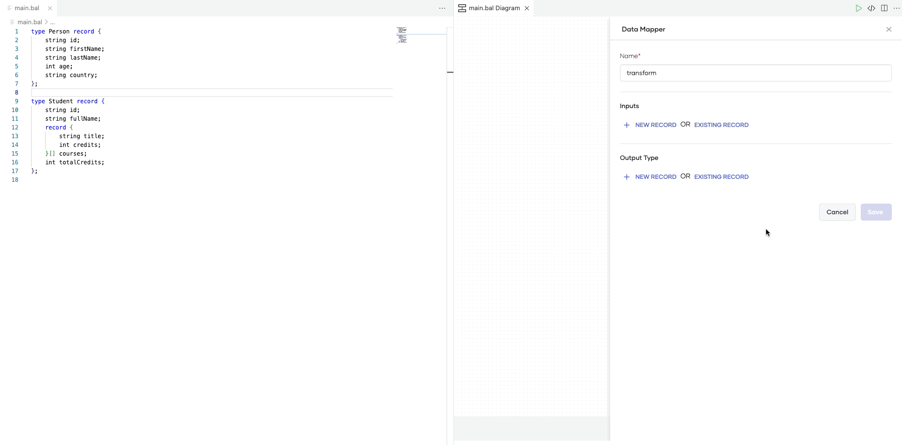

2. Enable adding all the intermediate clauses within query expressions with improved UI
   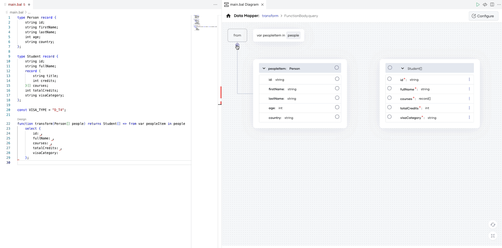

3. Add new input node to denote mappings associated with module declarations
   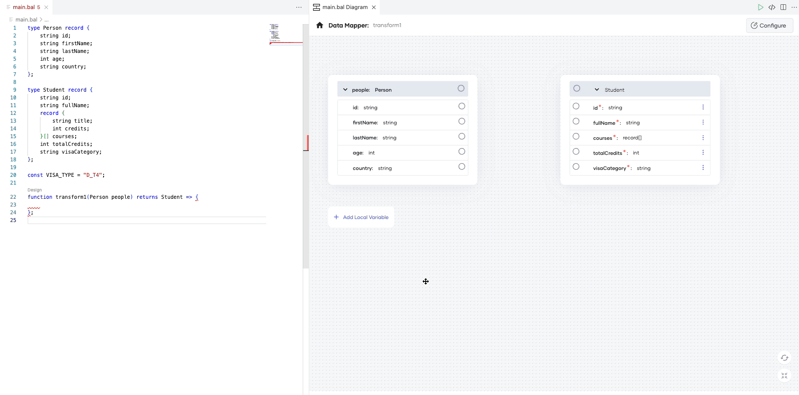

4. Add local variable declaration support at the function level
   

5. Enable selecting types from imported packages as inputs and output types
   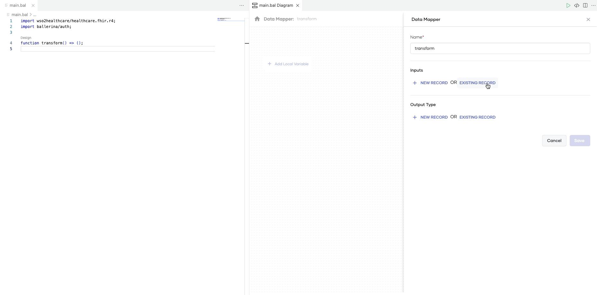

6. Add support for union type outputs
   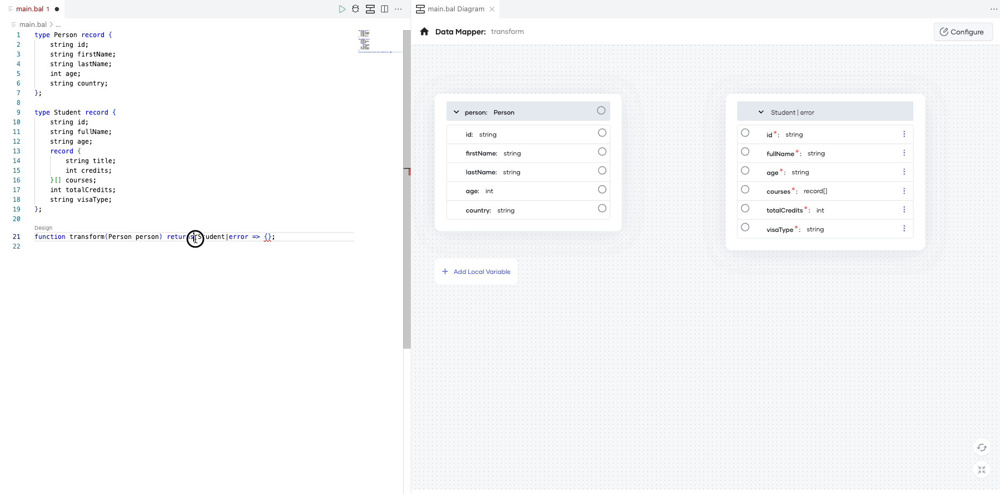

7. Add support for optional input record fields
    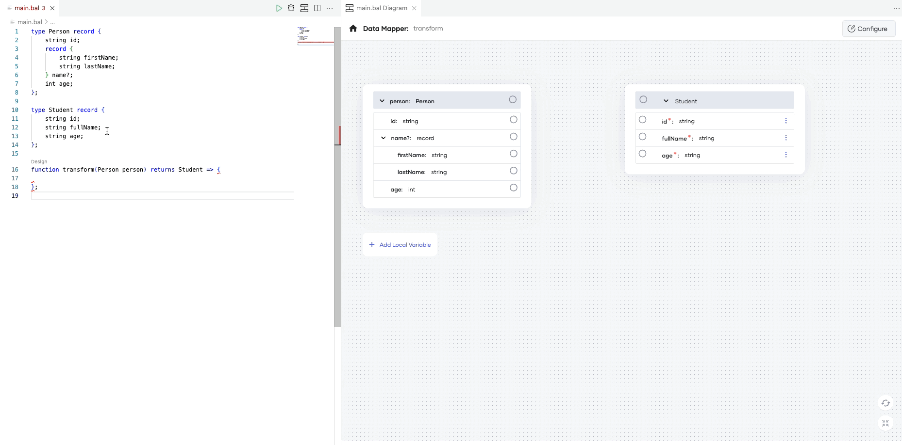

8. Enable mapping with query expressions for primitive type arrays
    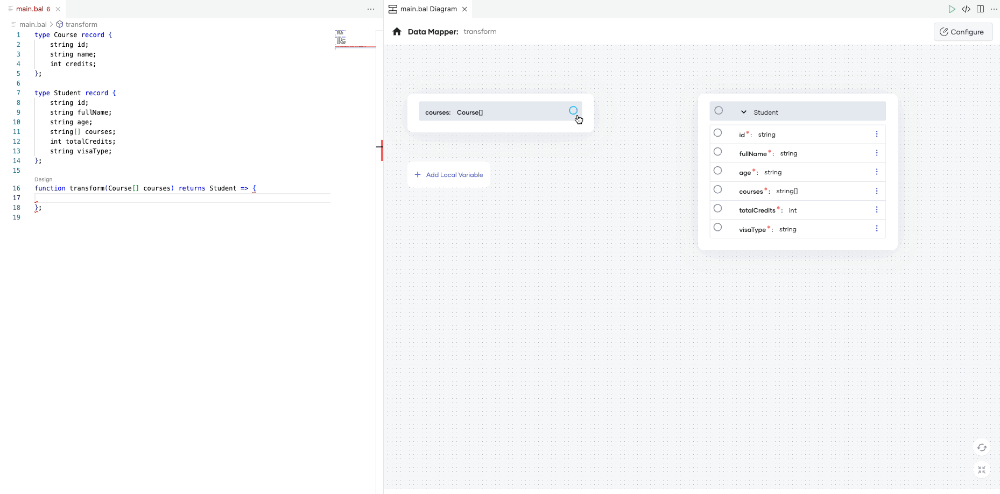

### Usability Improvements
1. Enable opening the Data Mapper through ‘Design’ code lens
   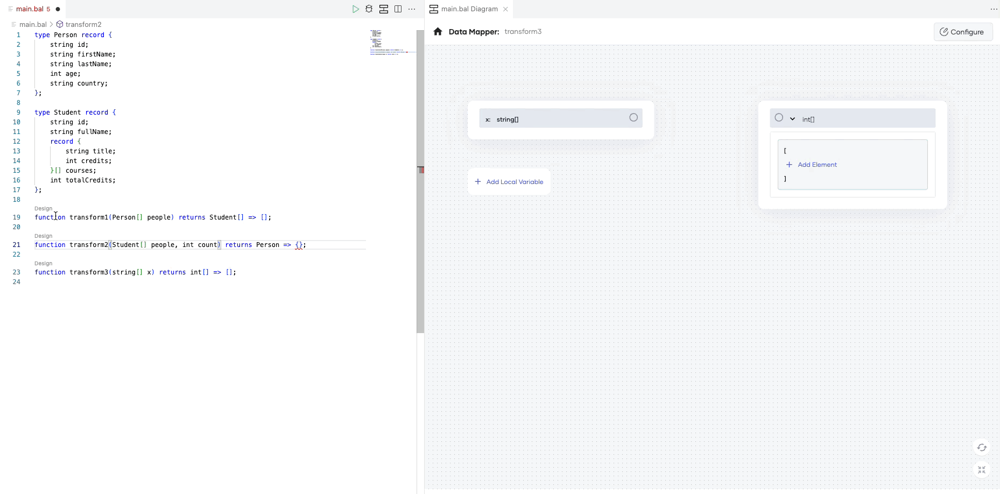

2. Add support to access query expressions defined within let expressions
   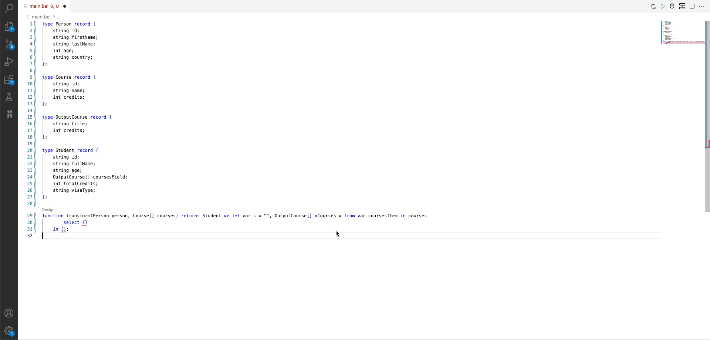

3. Function name validation with unique name suggestions
   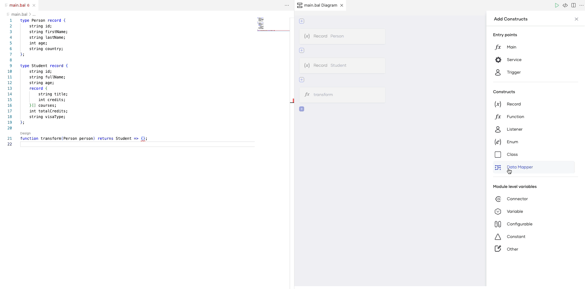

4. Improvements in ports and links selection (select, deselect, disable parent ports if children mapped, etc)
    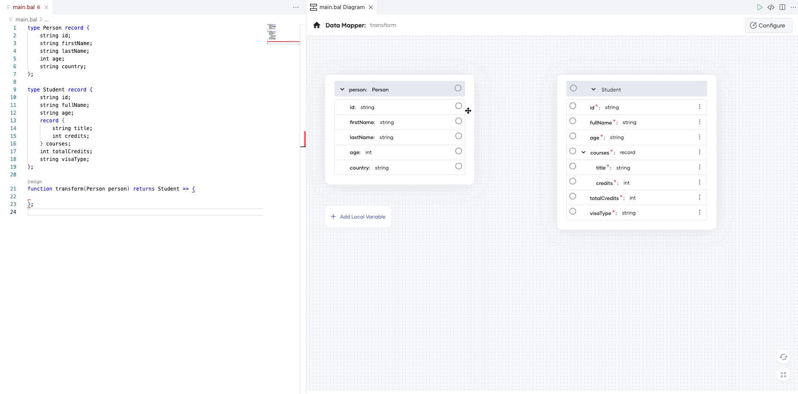

5. UI/UX improvements in link creations and deletions with loaders
    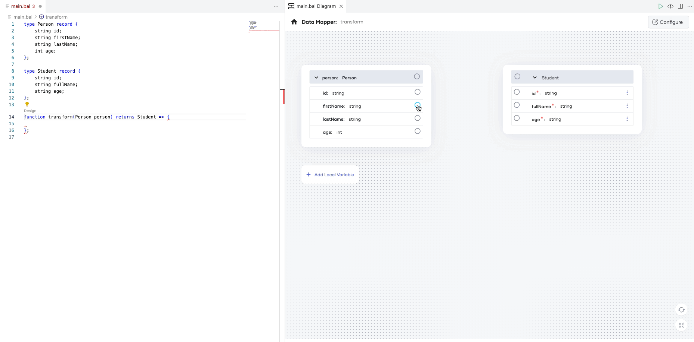

6. Delete support for custom values, arrays and array elements
    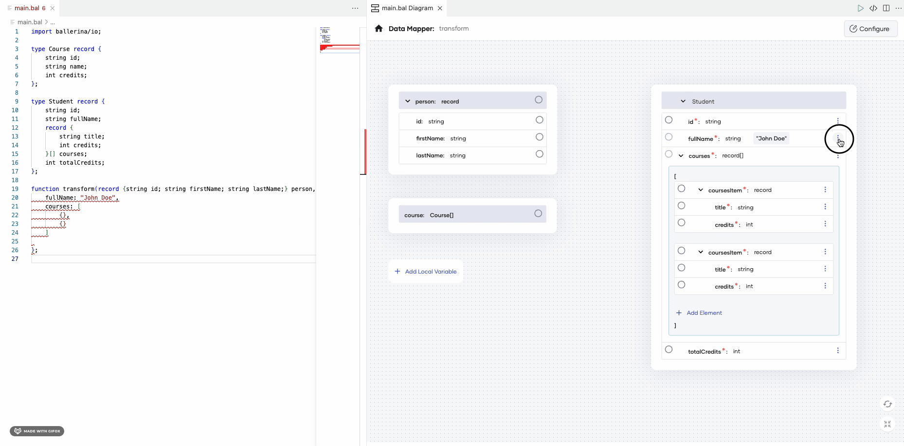

7. Improvements in fields (display required fields, disable fields when the port is disabled)
    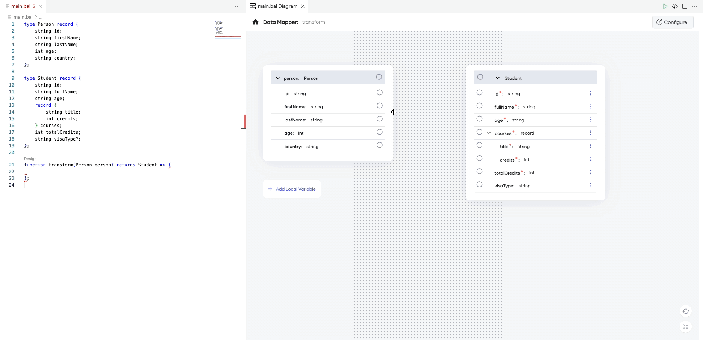

8. Add tooltip in link with code actions
    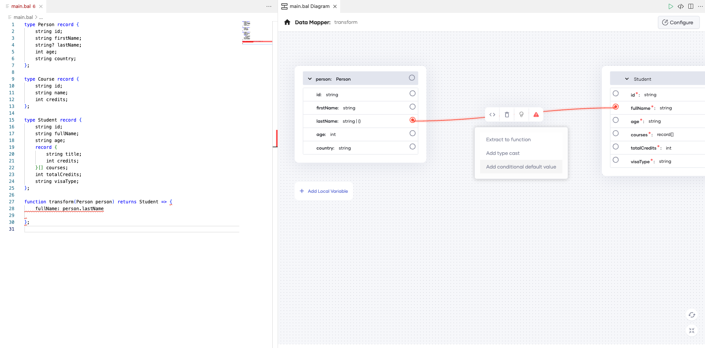

9. Add diagnostics tooltip to the link label
    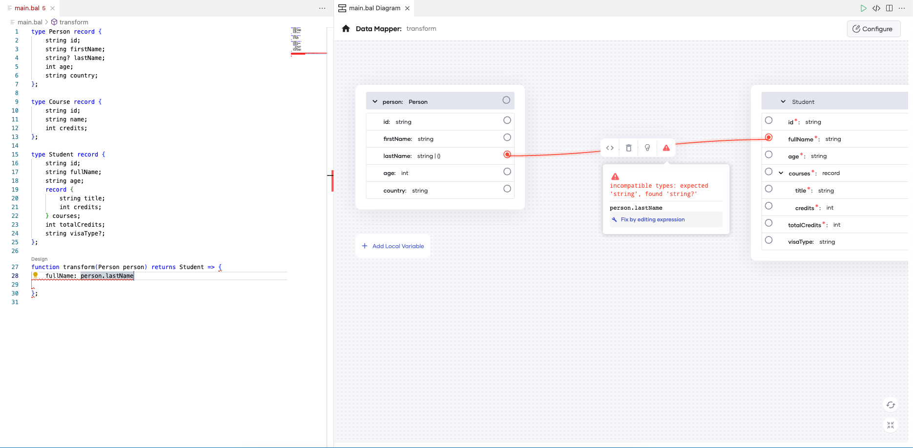

10. Gracefully handle the Data Mapper view when user makes incompatible changes using the code editor
    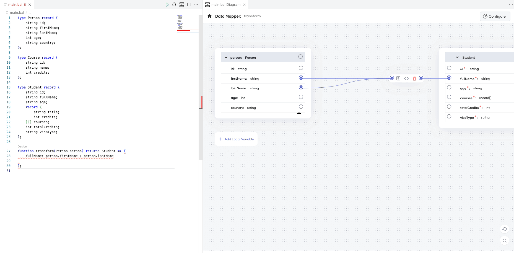

11. Add reset and fit-to-screen options
    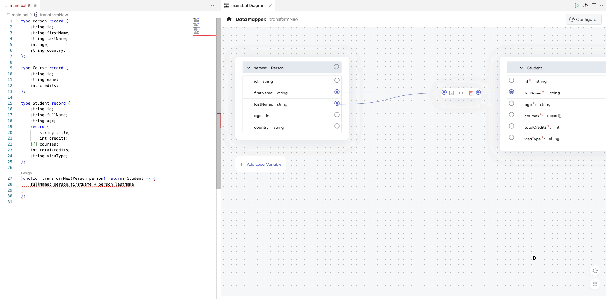

## In progress:

1. Add support for mappings with indexed query expressions
2. Provide search capability for filtering input, output fields

## Feature Backlog:

1. Auto update the function signature to include error return when required
2. Provide in-place record editing capability
3. Add support for table types
4. Improve the overall UX to be consistent with project-architecture view and the graphql views
5. Add support for keyboard shortcuts
6. Provide support for changing the mapped attributes without deleting the links
7. Improve UX for handling open records or var typed let variables in Data Mapper
8. Add support to extract expressions to local variables
