# data-mapper-update
## What's New

1. Expand support for various types of inputs and outputs other than records (basic types, arrays and inline records)
   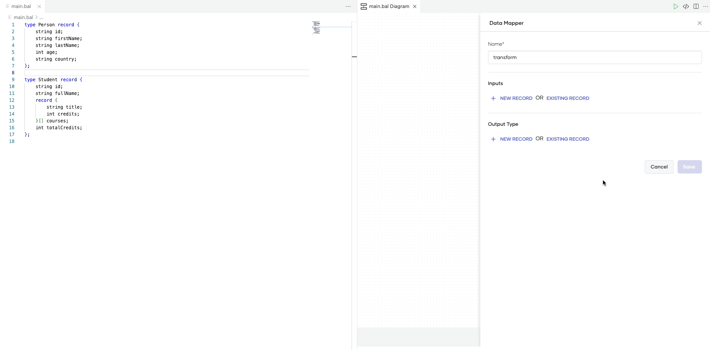

2. Enable adding all the intermediate clauses within query expressions with improved UI
   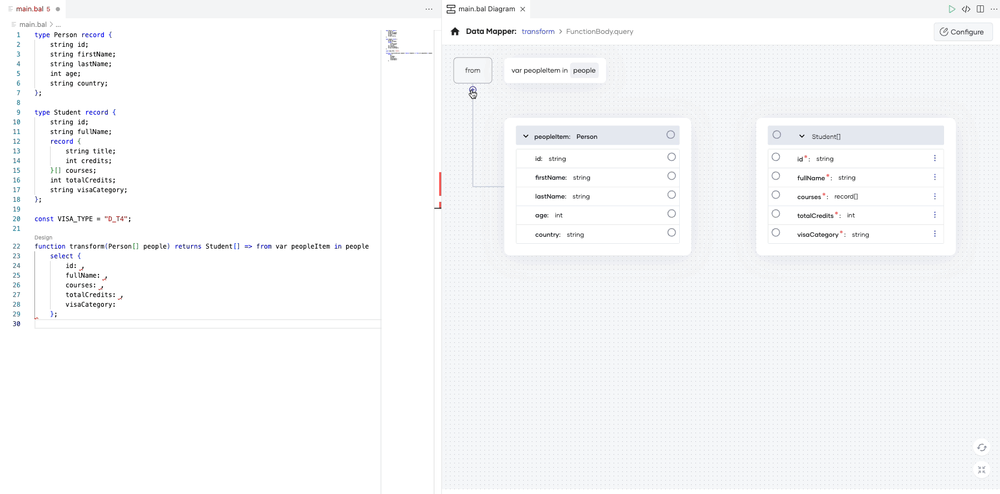

3. Enable opening the Data Mapper through ‘Design’ code lens
   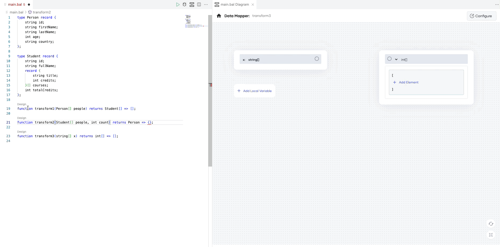

4. Add new input node to denote mappings associated with module declarations
   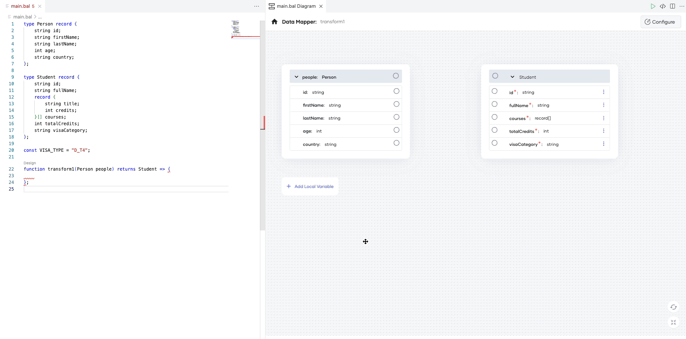

5. Add local variable declaration support at the function level
   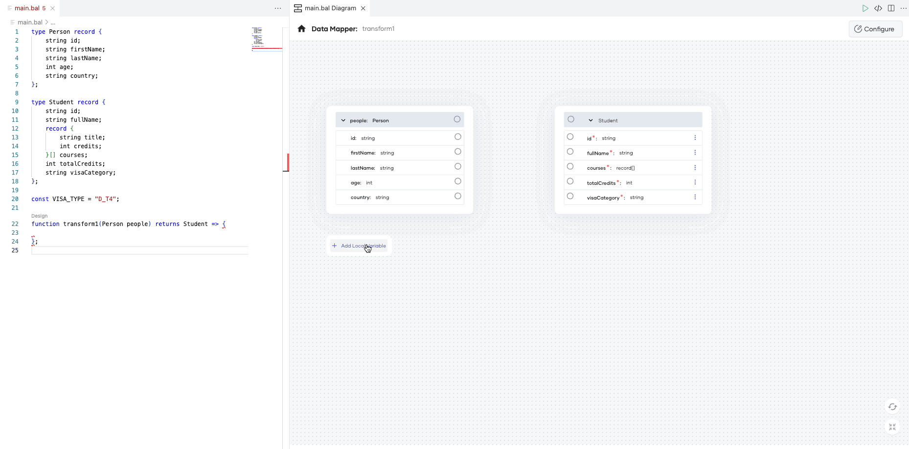

6. Enable selecting types from imported packages as inputs and output types
   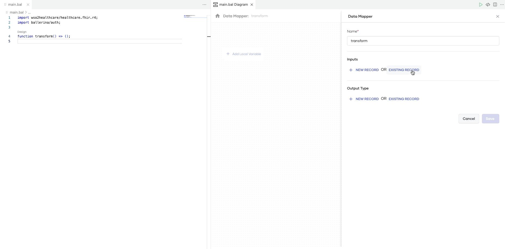

7. Add support for union type outputs
   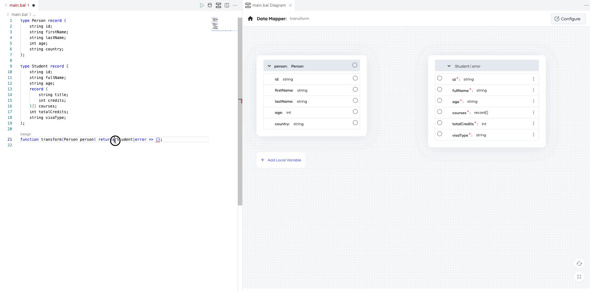

8. Add support to access query expressions defined within let expressions
   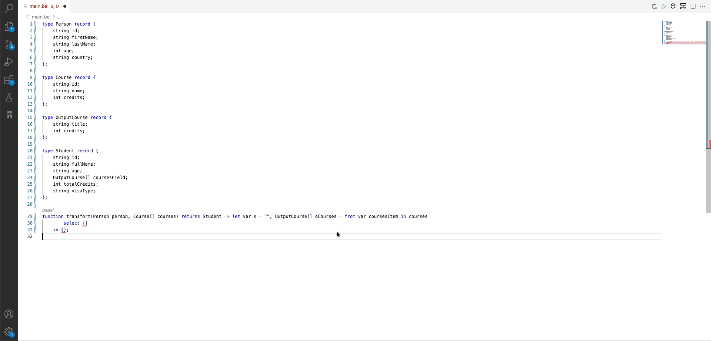

9. Function name validation with unique name suggestions
   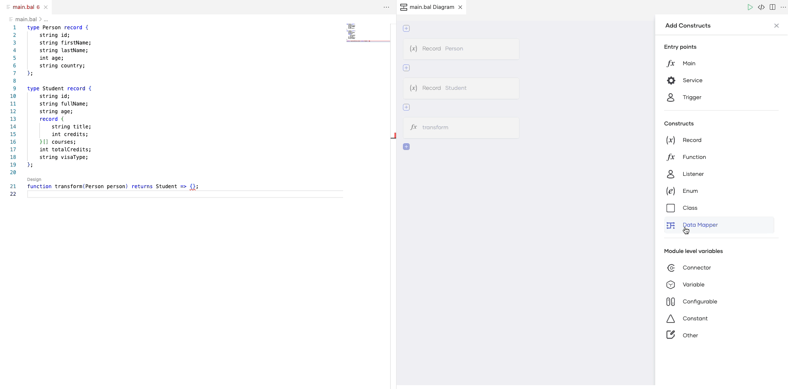

10. Improvements in ports and links selection (select, deselect, disable parent ports if children mapped, etc)
    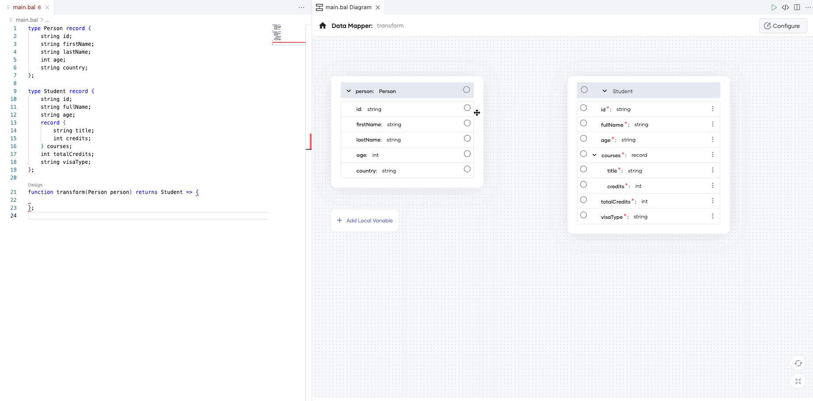

11. Add support for optional input record fields
    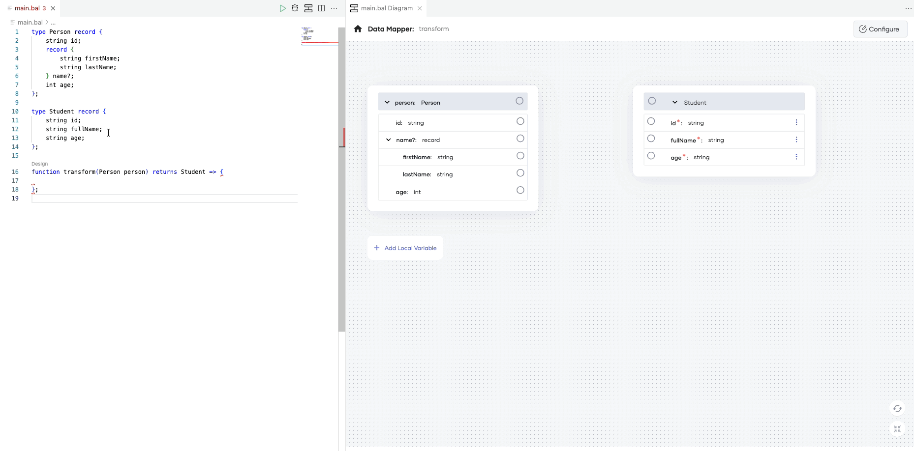

12. UI/UX improvements in link creations and deletions with loaders
    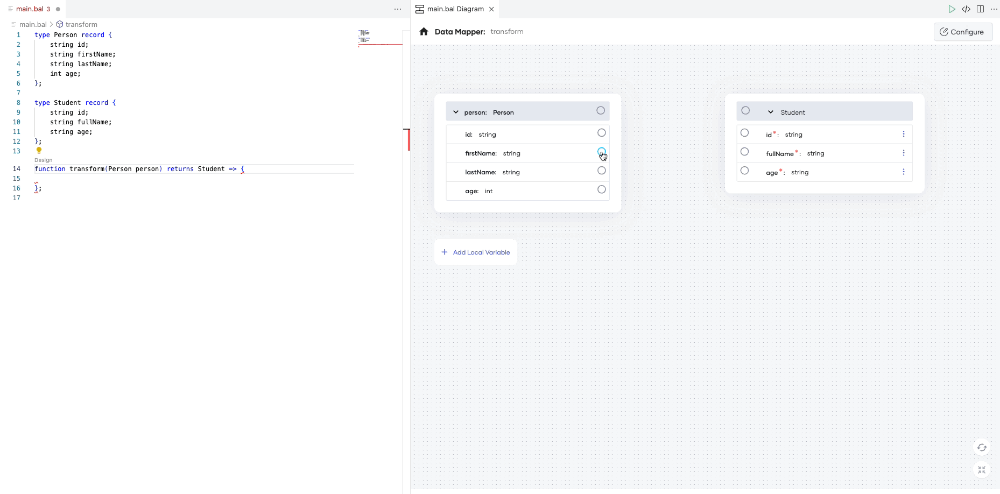

13. Delete support for custom values, arrays and array elements
    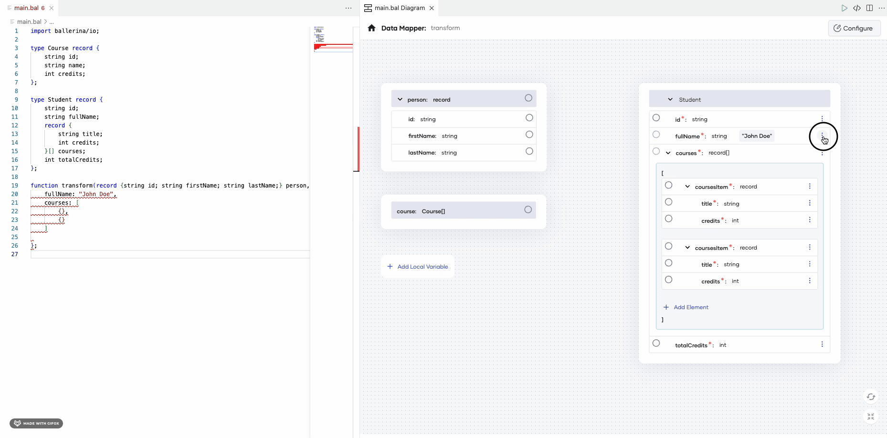

14. Improvements in fields (display required fields, disable fields when the port is disabled)
    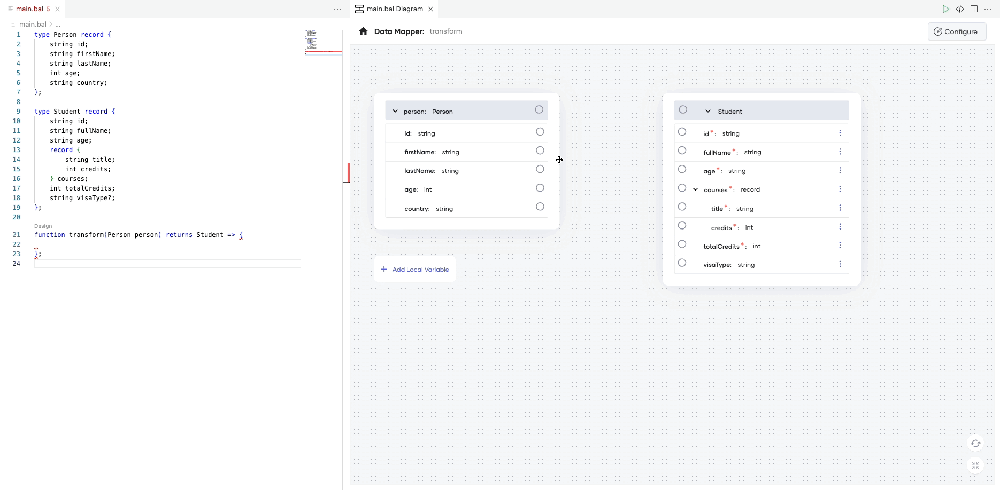

15. Add tooltip in link with code actions
    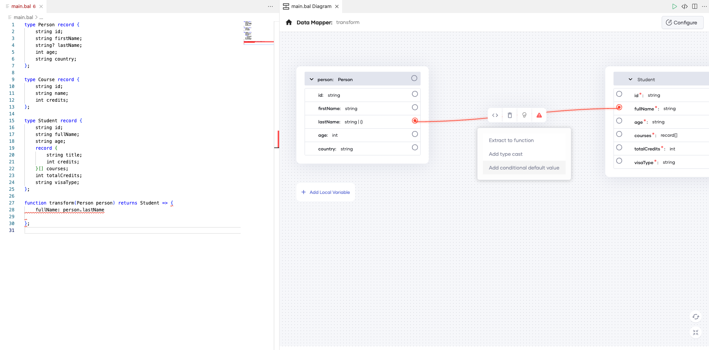

16. Add diagnostics tooltip to the link label
    

17. Gracefully handle the Data Mapper view when user makes incompatible changes using the code editor
    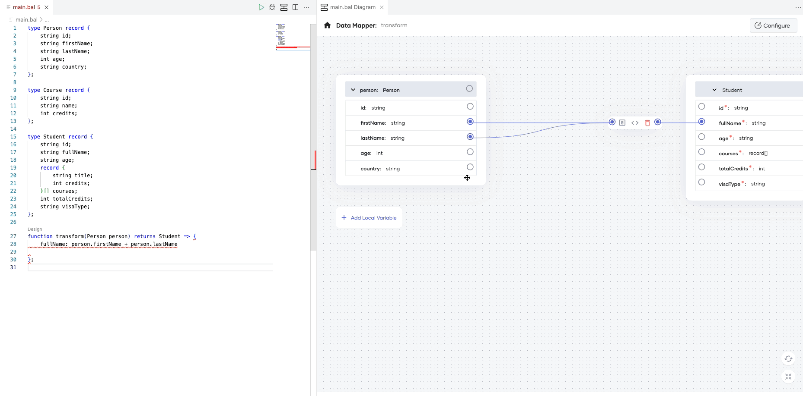

18. Add reset and fit-to-screen options
    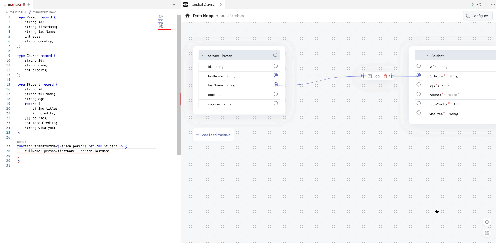

19. Enable mapping with query expressions for primitive type arrays
    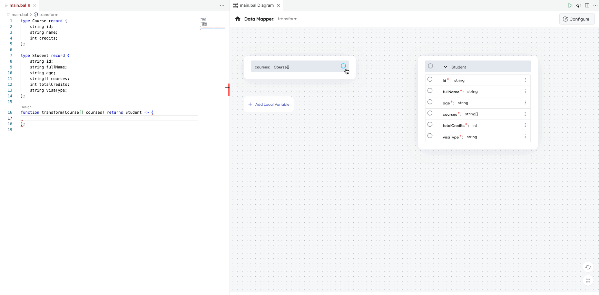

## In progress:

1. Add support for mappings with indexed query expressions

2. Provide search capability for filtering input, output fields

